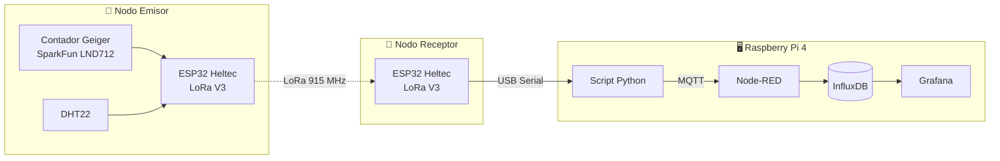
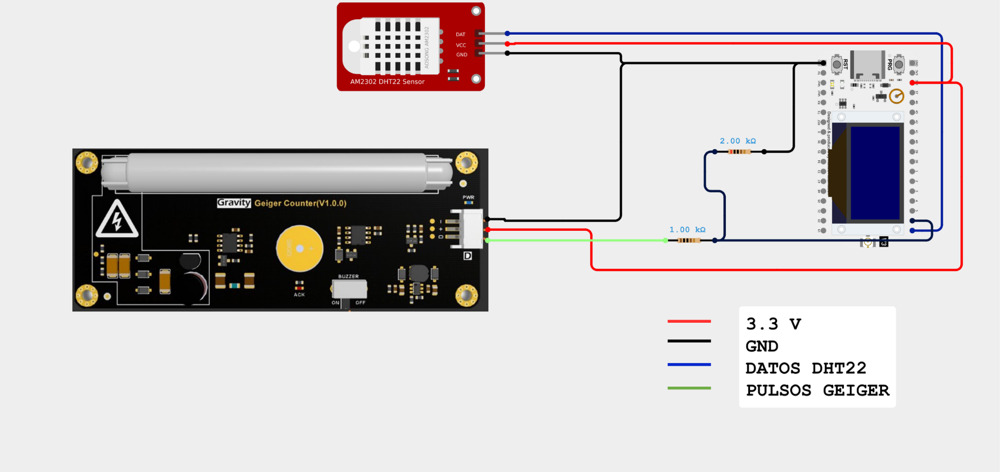
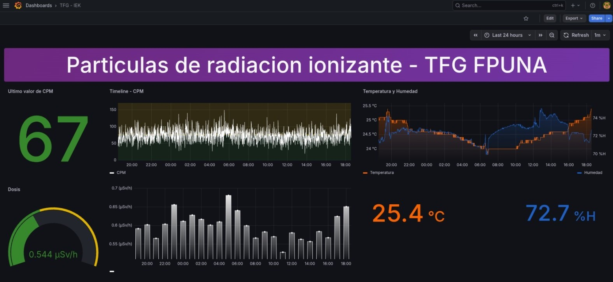
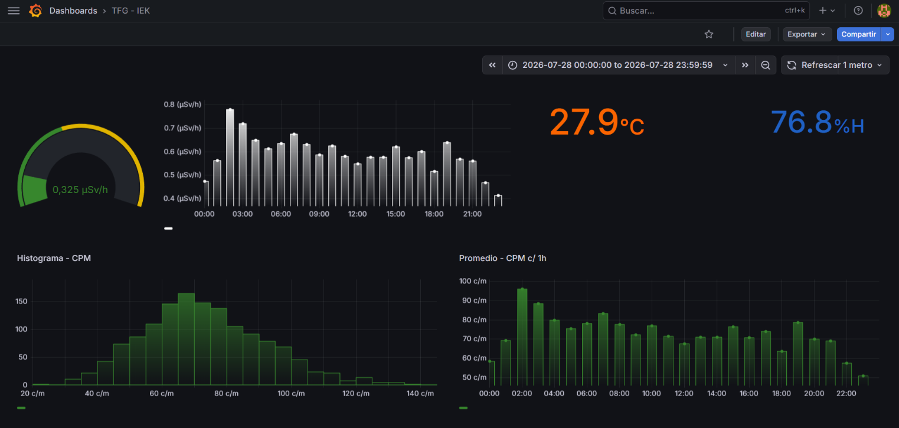

# TFG: Monitoreo de Radiación Beta-Gamma mediante IoT (IEK - Mecatrónica)

Este repositorio contiene el código fuente y la documentación del Trabajo de Fin de Grado titulado:

> **"DISEÑO DE UNA RED DE SENSORES MEDIANTE IoT PARA EL MONITOREO DE RADIACIÓN BETA-GAMMA ORIENTADO AL CAMPUS DE LA UNIVERSIDAD NACIONAL DE ASUNCIÓN"**

El sistema realiza la medición, transmisión, almacenamiento y visualización de niveles de radiación ionizante Beta y Gamma, junto con la temperatura y humedad del ambiente. Utiliza un detector Geiger-Müller conectado a un nodo **ESP32 LoRa** que transmite los datos de forma inalámbrica a un nodo receptor. Este último se conecta a una **Raspberry Pi 4 Model B**, que funciona como servidor: un script de **Python** publica los datos en **MQTT**, **Node-RED** los procesa y se almacena en **InfluxDB**. Posteriormente en **Grafana** se genera y visualiza el dashboard de monitoreo.

---

## 🧭 Arquitectura del Sistema



**Flujo de datos:**
1. El nodo emisor cuenta los pulsos del tubo Geiger y lee el sensor DHT22.
2. Los datos (CPM, cuentas acumuladas, dosis estimada, temperatura y humedad) se empaquetan en una estructura binaria y se envían por LoRa.
3. El nodo receptor decodifica el paquete y lo reenvía en formato JSON por puerto serie a la Raspberry Pi.
4. El script de Python publica los datos en formato JSON a un broker MQTT.
5. Node-RED recibe el JSON, lo procesa y lo almacena en InfluxDB.
6. Grafana consulta InfluxDB y muestra los datos en el dashboard generado.

---

## 📁 Estructura del Repositorio

```
├── ESP32/            # Codigo fuente de los nodos emisor y receptor
├── Python/           # Script de lectura serie y publicación a MQTT
├── NodeRED/          # Flujo exportado (.json) de Node-RED
└── Documentacion/
    └── img/          # Diagramas, esquemáticos y capturas del sistema
```

* **📁 ESP32:** Códigos fuente de los microcontroladores, encargados de la lectura del detector Geiger-Müller y del sensor DHT22, y de la transmisión y recepción de los datos por LoRa.
* **📁 Python:** Script de procesamiento de datos y publicación a MQTT.
* **📁 NodeRED:** Flujo de recepción y procesamiento del formato JSON para su almacenamiento en InfluxDB.
* **📁 Documentacion/img:** Diagramas de flujo, esquemáticos y capturas del sistema.

---

## 🔧 Hardware y Componentes

| Componente | Modelo | Función |
| :--- | :--- | :--- |
| Microcontrolador | **Heltec WiFi LoRa 32 V3 (ESP32-S3)** ×2 | Nodo emisor y nodo receptor |
| Detector de radiación | **Contador Geiger SparkFun (Tubo LND712)** | Detección de radiación Beta y Gamma |
| Sensor ambiental | **DHT22** | Temperatura y humedad relativa |
| Servidor | **Raspberry Pi 4 Model B** | Procesamiento, almacenamiento y visualización |

---

## 💻 Software y Plataforma IoT

| Herramienta | Función |
| :--- | :--- |
| **Arduino IDE / C++** | Programación del firmware de los ESP32 |
| **LoRa (915 MHz)** | Comunicación inalámbrica entre nodos |
| **Python** | Lectura del puerto serie y publicación a MQTT |
| **MQTT (Mosquitto)** | Protocolo de mensajería entre el script y Node-RED |
| **Node-RED** | Procesamiento de datos y escritura en la base de datos |
| **InfluxDB** | Base de datos de series temporales |
| **Grafana** | Visualización de datos en dashboards |

---

## ☢️ Conversión de CPM a Dosis

La tasa de dosis equivalente se estima a partir de las cuentas por minuto (CPM) del tubo LND712:

$$
\dot{H} \; [\mu Sv/h] = CPM \times 0.00812
$$

El factor **0.00812** corresponde a la calibración del tubo LND712 recomendado por el fabricante. 

---

## 📊 Demostración Visual

### Circuito y Conexiones

Esquema del conexionado eléctrico del nodo emisor, que integra el contador Geiger-Müller y el sensor DHT22 con el ESP32.



### Dashboard de Monitoreo

Capturas de pantalla de la interfaz gráfica en Grafana:

| Panel General | Análisis de Datos |
| :---: | :---: |
|  |  |

---

✒️ **Autores:** María Patricia Beatriz Ojeda Villalba | Rodrigo Iván Muñoz Pereira  
🎓 **Institución:** Facultad Politécnica - Universidad Nacional de Asunción  
📅 **Año:** 2026